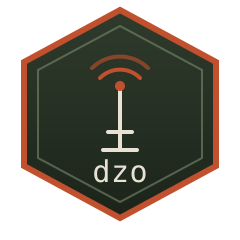

<!--
SPDX-FileCopyrightText: 2026 Bernd Zeimetz <bernd@bzed.de>
SPDX-License-Identifier: AGPL-3.0-or-later
-->

<div align="center">
  

  <h1>dzo</h1>
  <p><strong>A DayZ dedicated server operator for rootless podman.</strong></p>

  [](https://github.com/bzed-ai/dayz-server-operator/actions/workflows/ci.yml)
  [](https://codecov.io/gh/bzed-ai/dayz-server-operator)
  [](https://goreportcard.com/report/github.com/bzed-ai/dayz-server-operator)
  [](https://pkg.go.dev/github.com/bzed-ai/dayz-server-operator)
  [](https://api.reuse.software/info/github.com/bzed-ai/dayz-server-operator)
  [](LICENSE)
</div>

---

`dzo` manages DayZ dedicated server instances on top of **rootless podman**
and **systemd quadlets** — no Node.js, no `podman generate systemd`, and no
external RCon tools. It's a single static Go binary that installs and
updates server builds and workshop mods into immutable, shareable
generations, renders each instance's mission and configuration from a
site-config repo, and talks to the game server directly over a built-in
BattlEye RCon client.

This replaces a fleet of ad-hoc bash scripts (`dzpodman`, `bercon-cli`,
`dayz_restart`, …) that grew organically across several production DayZ
servers, with one tool, one config model, and a test suite. The full
design — decisions, legacy analysis, architecture and the phased roadmap —
lives in [`IMPLEMENTATION_PLAN.md`](IMPLEMENTATION_PLAN.md); user-facing
documentation is a [Sphinx site](docs/) under `docs/`.

> **Status:** Phase 1 (core + CLI) is substantially built: every package
> below is implemented and tested, up to and including instance lifecycle
> (quadlet/timer materialization, systemd start/stop/restart, the F3
> restart-storm brake, the BattlEye graceful-restart sequence). What's not
> built yet is wiring a *real* site-config instance end to end (resolving
> its mission/mod/product config into the pieces the packages below take
> as already-resolved input) and the phase 3+ web platform. See
> [Needs live verification](#needs-live-verification) below for what
> hasn't been checked against a real Steam account or DayZ server, and
> the plan's [phased roadmap](IMPLEMENTATION_PLAN.md#part-e--phased-roadmap)
> for what's tracked as still pending.

## What's here today

| Package | What it does |
|---|---|
| `internal/config` | Loads and validates `/etc/dzo/config.yaml` (data paths, products, notification targets) |
| `internal/servercfg` | Parses/writes `serverDZ.cfg` and diffs two versions before adoption |
| `internal/battleye` | A native BattlEye RCon client — login, commands, multi-packet responses, the connect/GUID/chat/kick event stream — no `bercon-cli`, no external RCon library |
| `internal/ce` | JSON deep-merge and XML child-merge primitives for combining mission/mod/overlay data, plus `cfgeconomycore.xml` `<ce folder>` registration |
| `internal/quadlet` | Renders podman quadlet `.container` units (health checks, host/publish networking, mounts, F3's start-rate limit) without relying on deprecated or newer-than-baseline podman tooling |
| `internal/cache` | An immutable, generation-based download cache with atomic activation and safe garbage collection |
| `internal/site` | The site-config repo's schema types (`site.yaml`/`instance.yaml`/overlays) and git plumbing (clone/pull/commit/push) |
| `internal/mission` | The live mission render/apply pipeline (`dzo instance render`: git pristine fetch, fallback fill, staging, apply): manifest tracking, apply-plan classification, atomic writes with a filehistory safety net, and the CE/XML/JSON merge dispatcher |
| `internal/a2s` | The Valve A2S server-query protocol client (challenge handshake + `A2S_INFO`) |
| `internal/health` | `dzo health startup`/`live` — process + A2S (+ optional RCon) probes for `HealthStartupCmd`/`HealthCmd` |
| `internal/hooks` | Runs the `pre_start`/`post_stop`/... extension-point scripts with a `DZO_*` env contract and a JSON context |
| `internal/notify` | Discord webhook notifications, per-event templates, and event coalescing |
| `internal/monitor` | Prometheus `/metrics`, JSON `/status`, and Icinga/Nagios-compatible checks |
| `internal/steam` | The interactive steamcmd login state machine (pty-driven prompt classifier) and a non-interactive mode for scheduled jobs |
| `internal/product` | The update-window/batching scheduling decision, a Steam Web API mod-freshness client, the steamcmd job runner for `+app_update`/`+workshop_download_item`, and the install flow that turns downloads and local servermods (dir, host path, URL+sha256) into validated immutable generations (`dzo product install\|update`, `dzo mod add\|update\|list\|refresh`) |
| `internal/moddeps` | CfgPatches `requiredAddons` dependency validation and load-order sorting, from a PBO (rapified `config.bin`, LZSS entries) or a plain-text `config.cpp` |
| `internal/resolve` | Combines `config.yaml`, the site checkout (`site.yaml` defaults + `instance.yaml`) and the cache into one resolved instance, including its quadlet spec; behind `dzo instance show` |
| `internal/instance` | Ties the above into one instance's lifecycle: the F3 failed-render gate, quadlet+timer materialization, systemd start/stop/restart, and the BattlEye lock/kick graceful-restart sequence |
| `cmd/dzo` | The CLI wiring all of the above together |

## Installing

**From a release build:** grab the `.deb` or a static binary from the
[latest CI run's artifacts](https://github.com/bzed-ai/dayz-server-operator/actions/workflows/ci.yml)
(tagged releases will publish these automatically once cut).

**From source** (needs a recent Go toolchain — see `go.mod`):

```console
$ git clone https://github.com/bzed-ai/dayz-server-operator.git
$ cd dayz-server-operator
$ make build
$ ./bin/dzo version
```

**As a Debian package** (targets Debian trixie):

```console
$ sudo apt install debhelper build-essential
$ dpkg-buildpackage -us -uc -b
$ sudo apt install ../dzo_*.deb
```

## Usage

```console
$ dzo version
0.1.0 (a1b2c3d, 2026-09-26T15:00:00Z)

$ dzo config validate --config /etc/dzo/config.yaml
config /etc/dzo/config.yaml is valid
  data:      /var/lib/dzo
  instances: /var/lib/dzo/instances
  products:  2 configured

$ dzo servercfg diff /profiles/serverDZ.cfg.save /files/serverDZ.cfg
~ hostname: "old name" -> "new name"
+ steamQueryPort

$ dzo rcon exec --addr 127.0.0.1:2303 --password s3cret players

$ dzo cache list /var/lib/dzo/cache/products/dayz-stable
* 1234567
  1234600

$ dzo instance show myserver --quadlet > dzo-myserver.container

$ dzo steam login --user mysteamaccount
steamcmd password for mysteamaccount: ****
login OK

$ dzo mod deps mods/@MyMod/config.cpp --provides DZ_Data,DZ_Scripts --order
all requiredAddons entries are satisfied

$ dzo instance restart myserver --graceful --rcon-addr 127.0.0.1:2303 --rcon-password s3cret
```

Run `dzo --help` (or `<command> --help`) for the full flag reference.

## Developing

```console
$ make lint      # gofmt, go vet, golangci-lint
$ make reuse     # SPDX/REUSE licence header check
$ make test      # unit tests
$ make cover     # tests + the 85% coverage gate (D20)
$ make licenses  # dependency licence allow-list check (D15)
```

`.github/workflows/ci.yml` runs all of the above on every push, plus
cross-compiled binary and `.deb` builds, and uploads both coverage and
JUnit test results to Codecov. See
[`CONTRIBUTING` notes in the plan](IMPLEMENTATION_PLAN.md#c15-testing-strategy-and-ci-d20-d21)
for the full testing strategy.

## Needs live verification

This environment has no Steam account, no real DayZ install, and no
podman/systemd user session to develop against, so everything above is
built and tested against real, documented file/wire formats and
fake-server/fake-script test doubles — not against the real thing. These
are the specific spots that need checking against a live setup before
relying on them, roughly in the order they'd bite:

- **steamcmd's interactive prompts and job output** (`internal/steam`,
  `internal/product`): the password/Steam-Guard/mobile-confirmation
  prompt wording and the `+app_update`/`+workshop_download_item`
  success/failure lines are reverse-engineered from community reports,
  not exercised against a real account.
- **Rapified `config.bin` and `Cprs` (LZSS) PBO entries** (`internal/moddeps`):
  decoders are implemented from published format descriptions and tested
  only against synthetic fixtures. Verify against a few real workshop mod
  PBOs (compressed and uncompressed entries, nested arrays, `+=` arrays)
  with `dzo mod cfgpatches`; the LZSS ring-offset convention is the least
  certain part.
- **The install flow against a real steamcmd** (`internal/product`):
  where steamcmd puts workshop items (`<force_install_dir>/steamapps/workshop/
  content/<app>/<id>`), the `appmanifest_<app>.acf` build id, the
  `appworkshop_<app>.acf` layout the forced refresh edits, and `+force_install_dir`
  being honoured by `workshop_download_item` are all from documentation and
  memory. Not implemented: the "size plausible vs. `file_size`" check. Real
  workshop PBOs are only checked for parsing, not for a prefix.
- **BattlEye's `players` command output format** (`internal/instance`'s
  graceful-restart kick sequence) and the event message patterns
  (`internal/battleye`'s connect/GUID/chat/kick regexes, spike S4) are
  not confirmed against a real server. Timeout/error/concurrency paths
  in the RCon client itself are now covered by a race-detector-clean
  test pass, but there is still no automatic reconnect-with-backoff:
  once the read loop hits a connection error, that `Client` is done and
  callers have to notice and re-`Dial`.
- **The resolved quadlet unit** (`internal/resolve`): the `DayZServer`
  command line, the nested mounts over the read-only build (`/dayz/keys`,
  `/dayz/mpmissions`, `@<id>` mods) and the single `Exec=` line with
  `;`-quoting are only checked against podman's documented quadlet syntax.
  It assumes the runtime image has no `ENTRYPOINT`, and that mods can live in
  `@<workshop id>` directories instead of `@<Name>` (DayZ does not care about
  the directory name; unverified).
- **Pristine mission fetch** (`internal/mission`, `dzo instance render`):
  it shallow-fetches `mission_source.ref` with plain `git`; tested against
  local repos only. Fetching a bare commit id needs server support
  (GitHub allows it); branches and tags always work.
- **A2S `AppID` truncation** (`internal/a2s`): the wire field is a signed
  16-bit int; real DayZ app ids may wrap. Documented on `InfoResponse`.
- **The `enfMain` process name** (`internal/health`'s process-existence
  check) is an assumption from plan notes, not confirmed against a
  running server binary.
- **Podman quadlet keys** (`HealthStartup*`, `HealthOnFailure=kill`,
  `Notify=healthy`) need confirming on the actual target podman/systemd
  versions (spike S6 in the plan).
- **DayZ Experimental's app id/workshop app pairing** (1042420 consuming
  workshop content via 221100) is assumed, not confirmed (spike S1).

## Licence

AGPL-3.0-or-later. This repository follows the [REUSE](https://reuse.software/)
specification — every file carries an SPDX header, and licence texts live
under [`LICENSES/`](LICENSES/). See [`LICENSE`](LICENSE) and
[`debian/copyright`](debian/copyright) for details.
